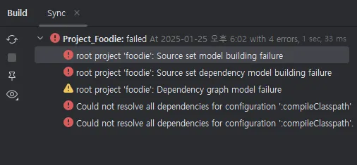
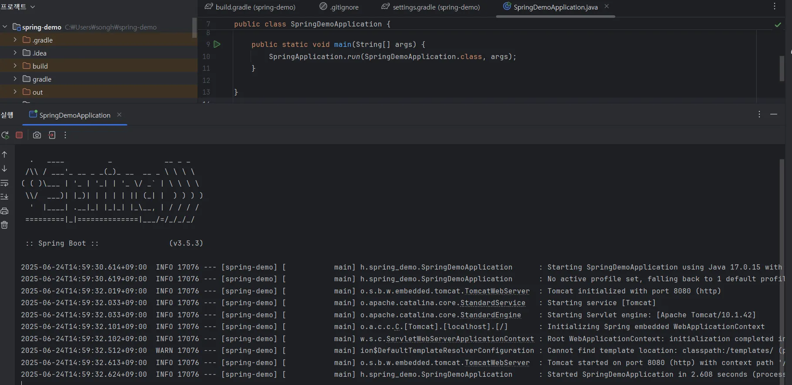
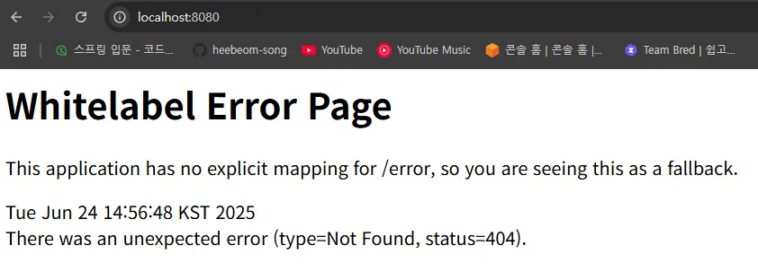

# 프로젝트 생성

https://start.spring.io/

→ 스프링 프로젝트를 생성해 주는 사이트임.

build.gradle → 버전, 라이브러리 설정 파일임.

이런 오류가 발생했는데 구글링 해보니 JAVA 버전이 스프링 프로젝트 설정과 맞지 않아서 그런거임.

build.gradle 찾아가보니까 17버전으로 설정되어 있어서 17버전 자바 설치후 리빌딩하니 잘됨.

프로젝트 생성 성공~!