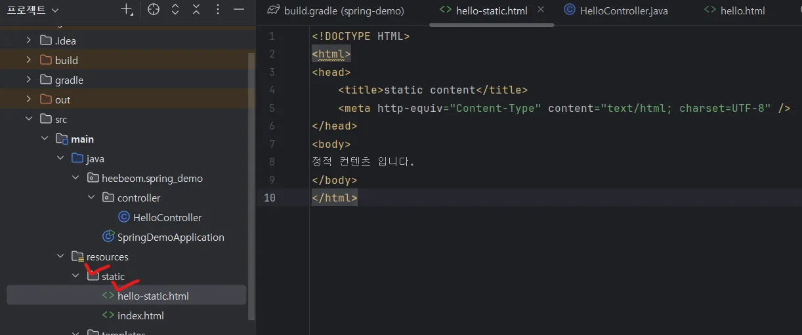
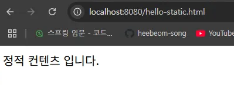
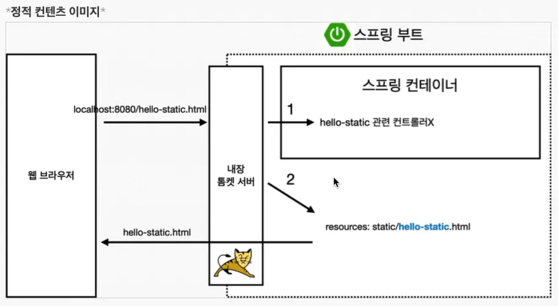

# 정적 컨텐츠

스프링을 활용해서 웹 개발을 하기 위한 방법은 아래 세가지가 있음.

1. 정적 컨텐츠
2. MVC와 템플릿 엔진
3. API

### 정적 컨텐츠

- 스프링 부트는 정적 컨텐츠 기능을 제공해줌.
[Spring Boot Features](https://docs.spring.io/spring-boot/docs/2.3.1.RELEASE/reference/html/spring-boot-features.html#boot-features-spring-mvc-static-content)

