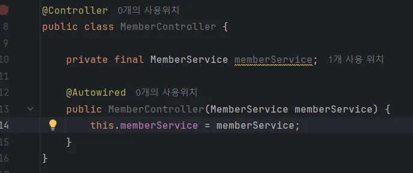
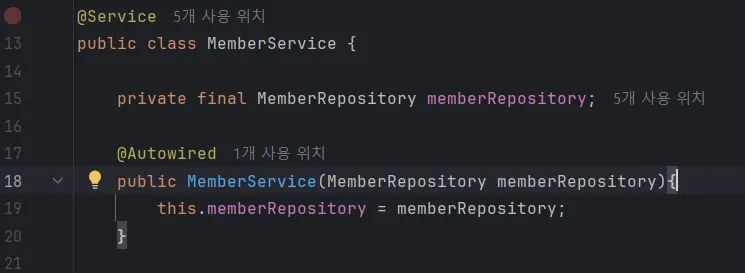
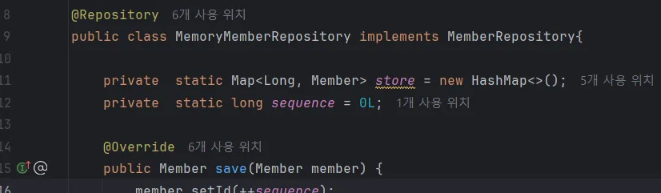
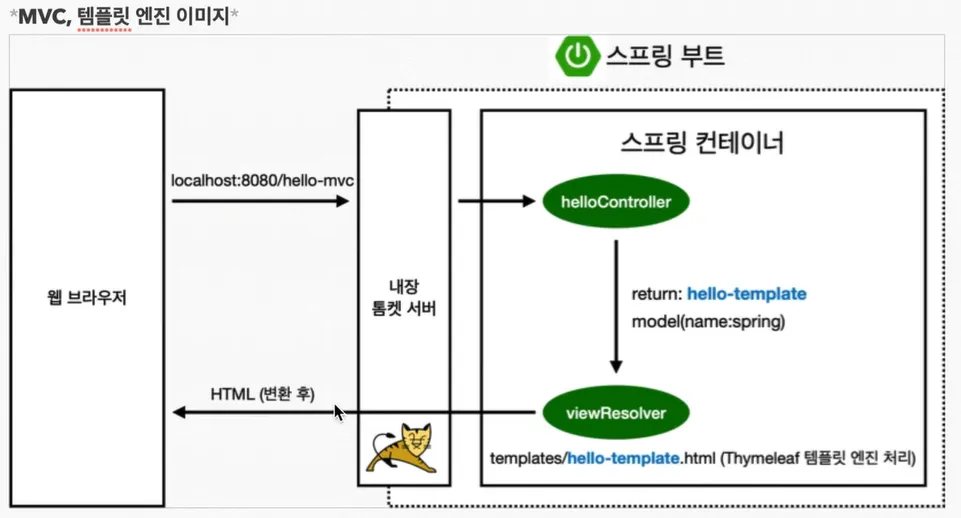
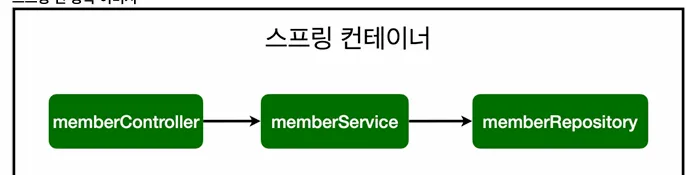

# 컴포넌트 스캔과 자동 의존관계 설정

**스프링 빈 등록 방법 2가지**

1. 컴포넌트 스캔과 자동 의존관계 설정
2. 자바 코드로 직접 스프링 빈 등록하기

**컴포넌트 스캔 원리**

@Component 어노테이션이 있으면 스프링 빈으로 자동 등록됨!

@Controller, Service, Repository 모두 내부적으로 컴포넌트 어노테이션을 포함하고 있어서 자동 등록되는 것임.

**자동 의존관계 설정**

생성자에 @Autowired를 사용하면 객체 생성 시점에 스프링 컨테이너에 해당 스프링 빈을 찾아서 주입함.

cf. 생성자가 1개면 @Autowired 어노테이션 생략 가능!

 

CF. 스프링은 컨테이너에 스프링 빈을 등록할 때 기본적으로 싱글톤으로 등록함. 즉 같은 스프링 빈이면 모두 같은 인스턴스를 사용한다는 뜻임. 의도적으로 싱글톤이 아니게 설정 가능하나 특별한 경우를 제외하면 보통 싱글톤으로 사용한다.