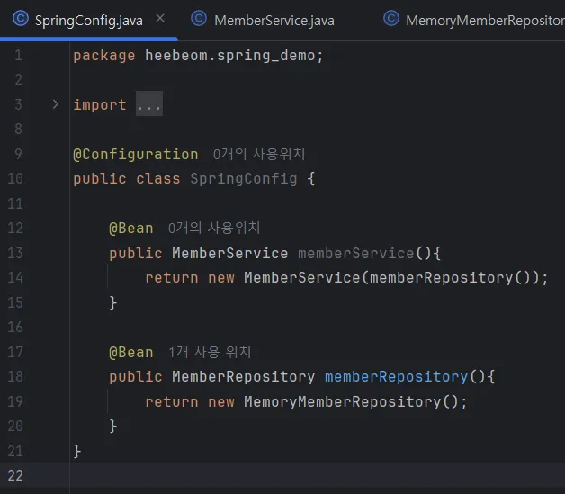

# 자바 코드로 직접 스프링 빈 등록하기

회원 서비스와 회원 리포지토리의 @Service, @Repository, @Autowired 애노테이션을 제거하고 SpringConfig 파일을 프로젝트 최상단에 생성하여 위 처럼 코드를 작성하면 직접 스프링 빈에 등록할 수 있음. 단, controller의 @Controller와 @Autowired 는 남겨두어야 함.

보통 위 처럼 직접 스프링 빈에 등록하는 방식은 상황에 따라 구현 클래스를 변경해야 하는 경우 많이 사용한다. 우리 예제의 경우에는 메모리 레포지토리(map 자료구조)를 향후 다른 레포지토리(진짜 DB)로 변경할 예정이기 때문에 직접 스프링 빈에 등록하는 방식을 사용한다.

참고로 DI에는 생성자 주입 방식 외에도 필드 주입과 setter 주입 방식이 있으나 의존관계가 실행중에 동적으로 변경되야하는 경우는 거의 없으므로 생성자 주입을 권장한다.