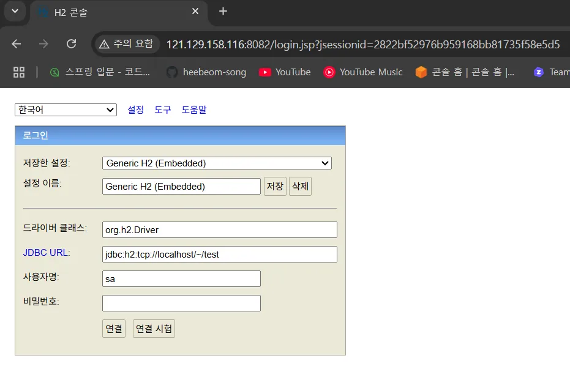
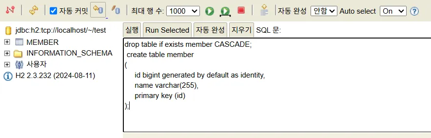
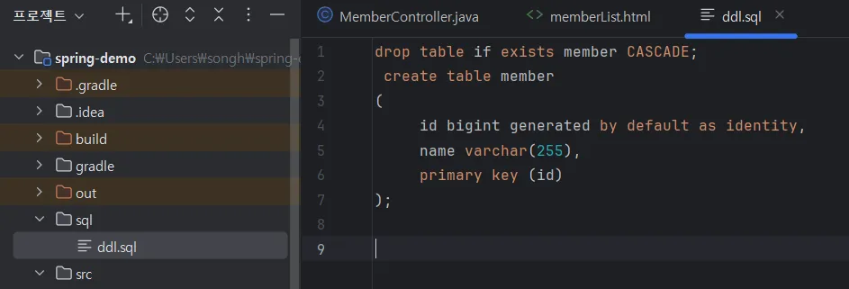

# H2 데이터베이스 설치

[https://www.h2database.com](https://www.h2database.com/)

최초 H2 콘솔에 접속하면 JDBC URL이 자동으로 `jdbc:h2:~/test` 로 되어 있음.

그 상태 그대로 연결 버튼 눌러서 DB 만들어주고`test.mv.db` 파일이 생성되었는지 확인!
이후 접속 부터는 JDBC URL에 `jdbc:h2:tcp://localhost/~/test` 을 입력해서 접속해야함. 이유는 이렇게 하면 소켓을 통해서 DB에 접근하는 것으로 여러 루트를 통해 DB에 접속해도 오류가 발생하지 않음.

위 처럼 DDL 입력해서 테이블 생성!

해당 DDL은 프로젝트 파일에 따로 sql 폴더를 만들어서 관리하면 편리함.

