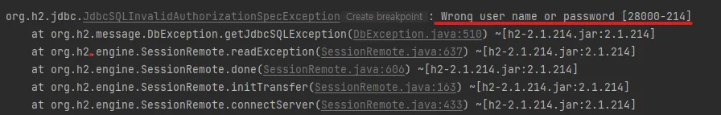

# 순수 JDBC

**build.gradle 파일에 jdbc, h2 데이터베이스 관련 라이브러리 추가**

```java
implementation 'org.springframework.boot:spring-boot-starter-jdbc'
runtimeOnly 'com.h2database:h2'
```

**스프링 부트 데이터베이스 연결 설정 추가**

```java
spring.datasource.url=jdbc:h2:tcp://localhost/~/test
spring.datasource.driver-class-name=org.h2.Driver
spring.datasource.username=sa
```

여기서 맨 마지막 줄 입력 안하면 



이런 에러가 뜨니까 주의!

**Jdbc 리포지토리 구현**

repository 패키지 아래 JdbcMemberRepository 파일을 생성!

상세 내용은 프로젝트 파일 참고!

예전에 데브코스에서 express로 서버 구현 할때 비슷하게 배운 기억이… 새삼  ORM의 감사함을 다시금 느꼈다…

**스프링 설정 변경**

기존 MemoryMemberRepository와의 연결을 끊고 JdbcMemberRepository와 연결해줌!

여기서 JAVA 객체지향적 프로그래밍의 장점을 느낄 수 있음!

기존 코드를 수정하지 않고 설정만으로 확장할 수 있다!!! → 개방-폐쇄 원칙(OCP, Open-Closed Principle)


