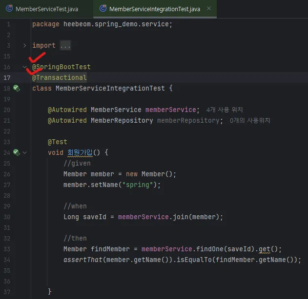
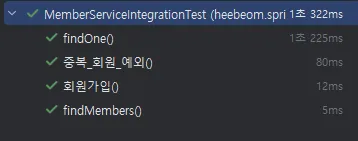

# 스프링 통합 테스트

- @SpringBootTest : 스프링 컨테이너를 올려놓고 테스트를 실행하게 해줌. → 통합 테스트!
- @Transactional : 테스트 시작 전에 트랜잭션을 시작하고, 테스트완료 후에 항상 롤백한다. 즉 DB에 데이터가 남지 않으므로 다음 테스트에 영향을 주지 않는다.
- 보통 작은 단위에서 테스트하는 단위 테스트가 더 명확한 테스트임. 통합 테스트보단 단위 테스트를 자주 하는 습관을 들이자!