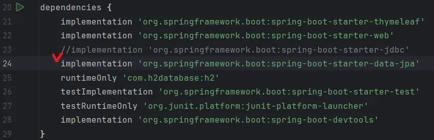
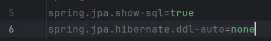
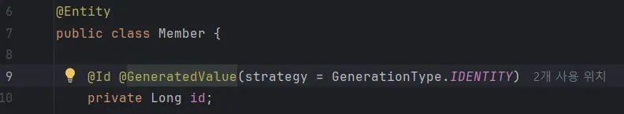
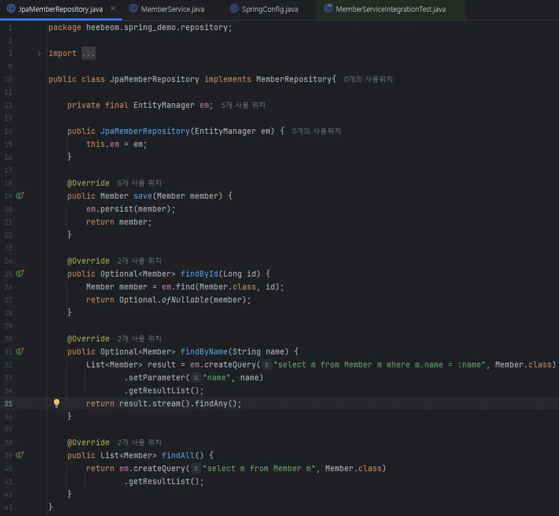
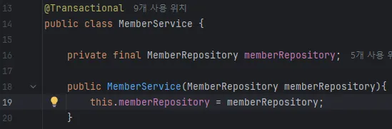
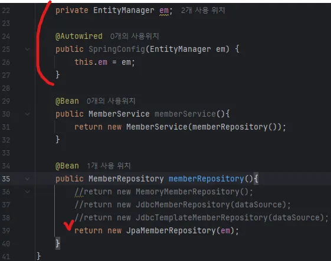

# JPA

JPA는 자바 표준 ORM임. → Express의 sequelize 같은 녀석!

sql과 데이터 중심 설계에서 객체 중심 설계로 패러다임을 전환할 수 있게 해줌.

 **build.gradle 파일에 JPA 관련 라이브러리 추가**

**application.properties에 JPA 설정 추가**

show sql → jpa가 생성하는 sql문을 출력해줌.

ddl-auto → 테이블 자동 생성 기능 off, none 대신 create 사용하면 엔티티 정보 바탕으로 테이블 자동 생성!

**JPA entity 맵핑**

**JPA 회원 리포지토리**

엄청 간단해진것을 확인할 수 있음!!

**서비스 계층에 트랜잭션을 추가해줘야 JPA 사용할 수 있음.**

스프링은 해당 클래스의 메서드를 실행할 때 트랜잭션을 시작하고, 메서드가 정상 종료되면 트랜잭션을 커밋한다. 만약 런타임 예외가 발생하면 롤백한다.
JPA를 통한 모든 데이터 변경은 트랜잭션 안에서 실행해야 한다.

**Spring.config 설정 변경**

**테스트 결과!**

