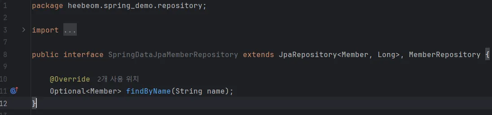

# 스프링 데이터 JPA
레포지토리에 구현 클래스 없이 인터페이스만으로 개발을 완료할 수 있게 해주는 착한 녀석!

인터페이스를 통해 기본 CRUD 기능을 스데J가 모두 제공
findByName() 처럼 메서드 이름 만으로 조회 기능 제공
페이징 기능 자동 제공

위 두 작업만 해주면 스데J가 SpringDataJpaMemberRepository를 스프링 빈으로 자동 등록해줌!!!!

**스데J 제공 클래스 참고**

cf. 실무에서는 JPA와 스프링 데이터 JPA를 기본으로 사용하고, 복잡한 동적 쿼리는 Querydsl이라는 라이브
러리를 사용함. 이 조합으로 해결하기 어려운 쿼리는 JPA가 제공하는 네이티브 쿼리를 사용하거나, JdbcTemplate를 사용하면 됨.