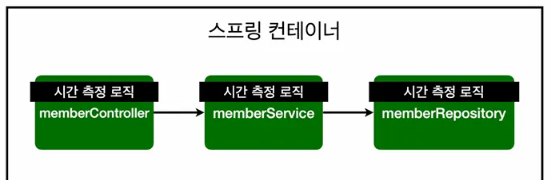
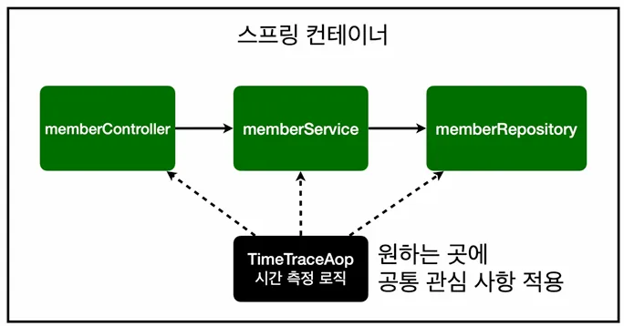
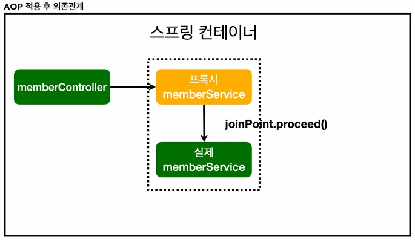

# AOP 적용
**AOP**: Aspect Oriented Programming
공통 관심 사항(cross-cutting concern) vs 핵심 관심 사항(core concern) **분리** 해줌!!

이랬던 녀석을!

요로코롬!!

프록시라는 가짜 스프링 빈을 임시로 생성한 후 내부 적으로 로직을 해결하고 joinPoint.proceed()를 만나면 그 때 실제 스프링 빈을 호출함.